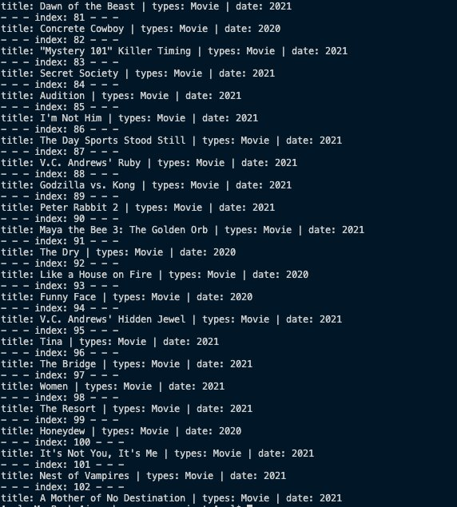

#web scraper project

## Description
This Web scraper extracts content and data from a [BFLIX](https://www3.bflix.to/). removes underlying HTML code and, gets us back the Names, types, and release dates of the movies on site. The scraper can then replicate the entire website data anywhere.




## Ruby web scraper for movies 
-


## Built With

- Ruby

## Getting Started

To get a local copy up and running follow these simple example steps.

### How to Use the Web Scraper

### Prerequisites

1. VSCode

2. Terminal (Bash)

3. Linter tests

4. Git

5. Ruby

### Setup

Setup by  following the installation instructions below :
* Open your terminal and locate on the folder you want to clone the repository.

### Install

- gems nokogiri

Run the following command into your terminal:

```console
git clone git@github.com:Amalcxc/web_scraper_project
```

### Usage

Run the following command into your terminal:

```console
ruby bin/main.rb
```

## How to test with Rspec

1. Open your terminal
2. To install Rspec, run the following command into your terminal: </br>
``` gem install rspec ```
3. Go to your local project repository with the cd command.
4. To run the test examples, run the following command into your terminal: </br>
``` rspec ```

## sources 
- [BFLIX website](https://www3.bflix.to/)

## Author

👤 **Amal Hersi**

- GitHub: [@Amalcxc](https://github.com/Amalcxc)
- Twitter: [@Amalcx4](https://twitter.com/Amalcx4)
- LinkedIn: [Amal Hersi](https://www.linkedin.com/in/amal-hersi-a29583205/)

## 🤝 Contributing

Contributions, issues, and feature requests are welcome!

Feel free to check the [issues page](https://github.com/Amalcxc/web_scraper_project/issues).

## Show your support

Give a ⭐️ if you like this project!

## Acknowledgments

- Thanks to Microverse and their supportive community.
- Thanks to everyone commiting in this project.

## 📝 License

This project is [MIT](./MIT.md) licensed.

